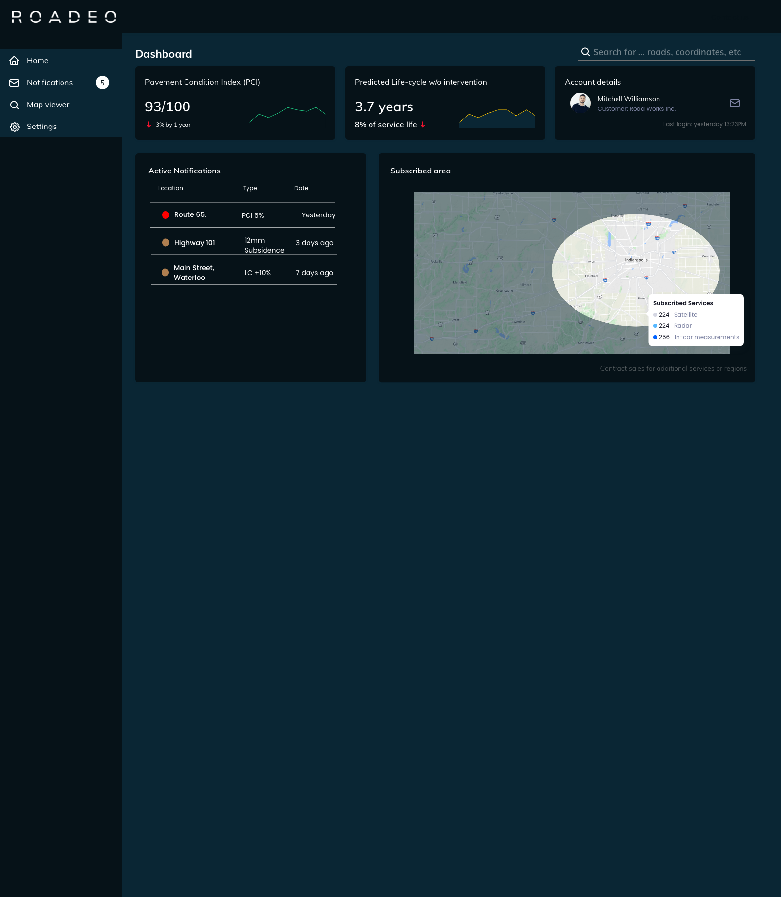

# React Developer Recruitment Task 

## Description
Your job is to code an app with posts of users with ability to manage posts and comments. Application must be SPA and use multiple routes (listed below). 

## Tech stack:
* API: [API DOCS](https://graphqlzero.almansi.me/api) 
* GQL: [client](https://www.apollographql.com/docs/react/get-started/)
* Starter: [Create react app starter](https://github.com/facebook/create-react-app) - TS template
* Routing: [React-router](https://github.com/ReactTraining/react-router)

## Screens:
* `Login` 
    
    * A simple login page with a simple form. 
    * On submit click you will redirect to `Homepage` page
* `Homepage` 
    
    * General Dashboard
    * 2 Kpis ( with graphs )(you will find in the Docs of the GQL server)
    * a list of notification
    * a user card (my account)
    * On notification click you will redirect to `Notification` page
* `Notification`
    
    * This page contains the details of the notification.
    * 3 Kpis (you will find in the Docs of the GQL server)
    * list of measurements
    * 2 Pictures (also in the GQL)
    * (ignore the two graps in the picture on the write side of the map)
## Optional Screen:
* `Profile Setting` 
    * Just create a form for the user details (just query the data from the server but no posting to the server)
## Must-have:
1. React 
2. Connection with API (GQL)
3. Usage of react-router for multiple pages
4. Loaders when you wait for the data (react-skeleton)
5. Usage of modern js functionality (ES6+)

## Good to have:
1. Clean code (linters, prettier)
2. UI kit for styles (or styled-components)
3. Tests
4. App deployed to [Netlify](https://www.netlify.com/)
5. Validation on forms

## What will we be paying attention to:
1. How you split code for components
2. How your manage your data.
3. Reusability of the components.
4. Code repetitions and reusability (keep your code [DRY](https://en.wikipedia.org/wiki/Don%27t_repeat_yourself) and simple [KISS](https://en.wikipedia.org/wiki/KISS_principle)).
5. How and where you put your business logic.
6. Working in accordance with good practices in general.
7. How you communicate with API.
8. Handling unexpected errors or potential exceptions.
